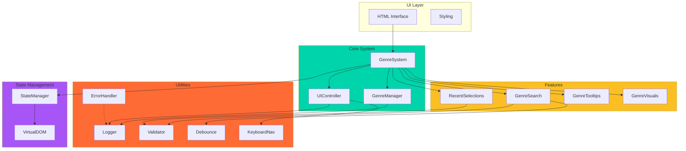
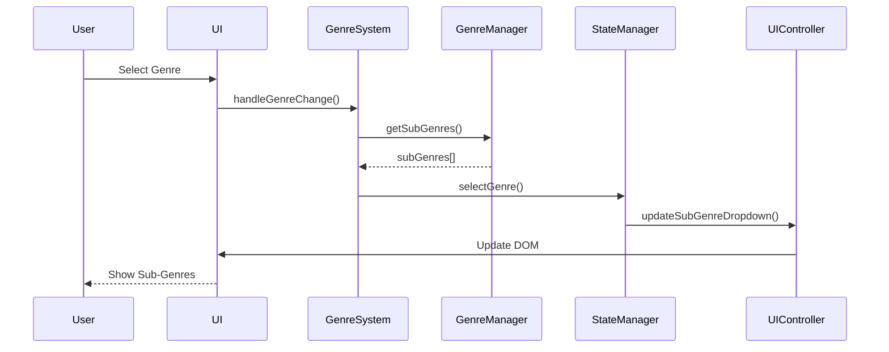
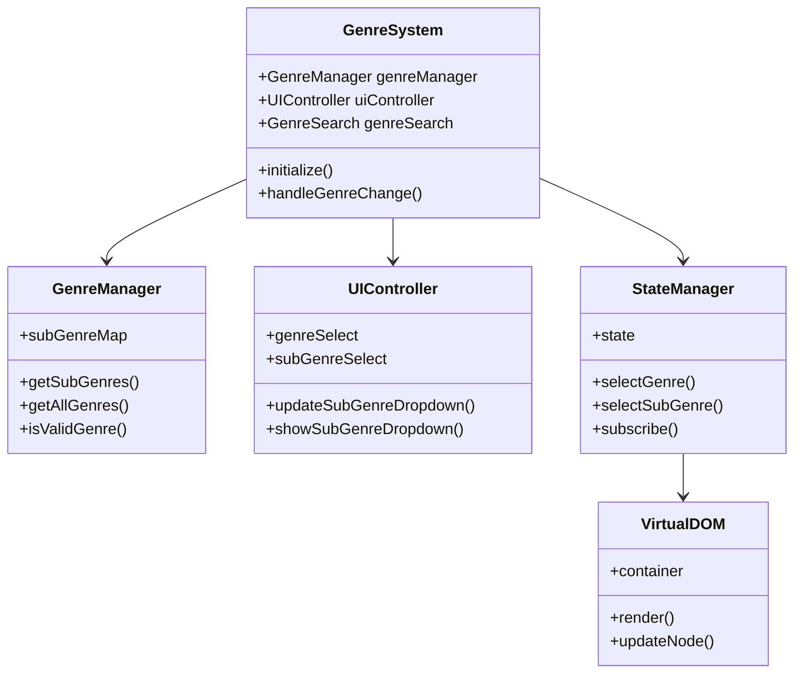

# Architecture Enhancements

## System Architecture Diagram



## Data Flow Diagram



## Component Relationships



This document describes the advanced architecture improvements implemented for the genre system.

## Overview

The genre system has been enhanced with:
1. **Build System (Vite)** - Modern bundling and optimization
2. **TypeScript** - Type safety and better developer experience
3. **State Management** - Lightweight Redux-like state management
4. **Virtual DOM** - Efficient rendering for large option lists
5. **Web Components** - Encapsulated custom elements

## 1. Build System (Vite)

### Setup

Vite provides:
- Fast HMR (Hot Module Replacement)
- Optimized production builds
- TypeScript support out of the box
- Modern ES modules

### Usage

```bash
# Development server
npm run dev

# Production build
npm run build

# Preview production build
npm run preview
```

### Configuration

See `vite.config.js` for:
- Build output configuration
- Path aliases (`@/` for `js/`)
- Terser minification
- Source maps

## 2. TypeScript

### Type Definitions

All modules now have TypeScript type definitions in `js/types.ts`:

```typescript
interface GenreConfig {
    defaultGenre?: string;
    subGenreMap?: Record<string, string[]>;
    enableSearch?: boolean;
    // ...
}
```

### Type Checking

```bash
npm run type-check
```

### Migration Strategy

- Existing `.js` files work alongside `.ts` files
- Gradual migration supported
- `allowJs: true` in `tsconfig.json`

## 3. State Management

### StateManager Class

Lightweight state management similar to Redux but simpler:

```typescript
import { StateManager } from './state-manager.js';

const stateManager = new StateManager({
    selectedGenre: 'house',
    selectedSubGenre: ''
});

// Subscribe to changes
const unsubscribe = stateManager.subscribe((state) => {
    console.log('State changed:', state);
});

// Update state
stateManager.selectGenre('techno');

// Cleanup
unsubscribe();
```

### State Structure

```typescript
interface GenreState {
    selectedGenre: string;
    selectedSubGenre: string;
    recentSelections: RecentSelection[];
    searchQuery: string;
    isSearchActive: boolean;
    uiState: {
        subGenreVisible: boolean;
        tooltipVisible: boolean;
    };
}
```

### Benefits

- **Predictable state updates** - All changes go through state manager
- **Reactive updates** - Components automatically update on state change
- **Time-travel debugging** - Can log state history
- **Testability** - Easy to test state transitions

## 4. Virtual DOM

### VirtualDOM Class

Efficient DOM updates using virtual DOM diffing:

```typescript
import { VirtualDOM, h } from './virtual-dom.js';

const container = document.getElementById('container');
const vdom = new VirtualDOM(container!);

// Render virtual node
vdom.render(
    h('div', { className: 'genre-list' }, [
        h('option', { value: 'house' }, 'House'),
        h('option', { value: 'techno' }, 'Techno')
    ])
);

// Update efficiently (only changed nodes update)
vdom.render(
    h('div', { className: 'genre-list' }, [
        h('option', { value: 'house' }, 'House'),
        h('option', { value: 'techno', selected: true }, 'Techno'),
        h('option', { value: 'trance' }, 'Trance')  // New
    ])
);
```

### Performance Benefits

- **Minimal DOM updates** - Only changed nodes are updated
- **Batch operations** - Multiple changes batched together
- **Efficient diffing** - Smart comparison algorithm
- **Memory efficient** - Virtual nodes are lightweight

### When to Use

- Large option lists (100+ items)
- Frequent updates
- Complex nested structures
- Performance-critical scenarios

## 5. Web Components

### GenreSelectorComponent

Encapsulated custom element:

```html
<genre-selector 
    id="my-genre-selector"
    genres='[{"value":"house","text":"House","group":"Electronic"}]'>
</genre-selector>

<script type="module">
    import './js/components/genre-selector.js';
    
    const selector = document.getElementById('my-genre-selector');
    
    // Listen for changes
    selector.addEventListener('genre-change', (e) => {
        console.log('Genre changed:', e.detail);
        // { genre: 'house', subGenre: 'deep_house' }
    });
    
    // Get current selection
    const selection = selector.getSelection();
</script>
```

### Benefits

- **Encapsulation** - Styles and logic isolated
- **Reusability** - Use anywhere in the app
- **Shadow DOM** - Style isolation
- **Standard API** - Uses Web Components standard

### Customization

```css
genre-selector {
    --genre-select-bg: #2a2a2a;
    --genre-select-color: #00d4aa;
}
```

## Integration Examples

### Basic Usage (Original System)

```javascript
import { initializeGenreSystem } from './js/genre-system.js';
initializeGenreSystem();
```

### Enhanced Usage (With State Management)

```typescript
import { initializeEnhancedGenreSystem } from './js/genre-system-enhanced.js';

const system = initializeEnhancedGenreSystem({
    enableSearch: true,
    enableRecentSelections: true
});

// Subscribe to state changes
const stateManager = system?.getStateManager();
stateManager?.subscribe((state) => {
    console.log('Current selection:', state.selectedGenre);
});
```

### With Virtual DOM

```typescript
const system = initializeEnhancedGenreSystem(
    { enableSearch: true },
    true  // Enable virtual DOM
);
```

### With Web Components

```html
<genre-selector id="genre-selector"></genre-selector>

<script type="module">
    import './js/components/genre-selector.js';
    
    const selector = document.getElementById('genre-selector');
    selector.addEventListener('genre-change', handleGenreChange);
</script>
```

## Performance Comparison

| Approach | Initial Render | Update Time | Memory |
|----------|---------------|-------------|--------|
| Traditional DOM | Fast | Slow (full re-render) | Low |
| Virtual DOM | Medium | Fast (diff only) | Medium |
| Web Components | Fast | Fast | Low |

## Migration Guide

### From Original to Enhanced

1. **Update imports:**
   ```typescript
   // Old
   import { initializeGenreSystem } from './js/genre-system.js';
   
   // New
   import { initializeEnhancedGenreSystem } from './js/genre-system-enhanced.js';
   ```

2. **Add state subscriptions:**
   ```typescript
   const system = initializeEnhancedGenreSystem();
   system?.getStateManager().subscribe((state) => {
       // React to state changes
   });
   ```

3. **Use TypeScript types:**
   ```typescript
   import { GenreSelection } from './js/types.js';
   const selection: GenreSelection = system.getSelection();
   ```

## Best Practices

1. **Use State Management** for complex state interactions
2. **Use Virtual DOM** for large lists (100+ items)
3. **Use Web Components** for reusable UI elements
4. **Use TypeScript** for type safety in new code
5. **Use Vite** for development and production builds

## Future Enhancements

- [ ] Redux DevTools integration for state management
- [ ] React/Vue adapter for virtual DOM
- [ ] More Web Components (search, tooltips, etc.)
- [ ] Full TypeScript migration
- [ ] Storybook for component documentation

