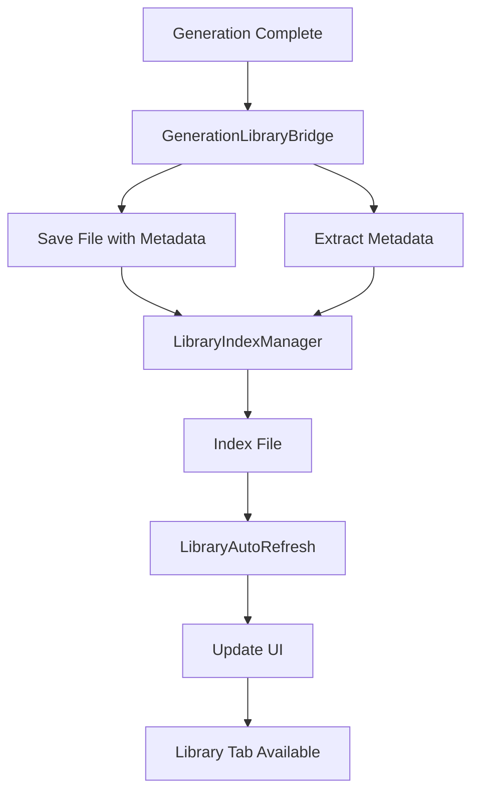

# Generation-to-Library Integration - Implementation Complete

## Overview

Complete integration system that automatically indexes generated files, extracts metadata, organizes them, and makes them immediately available in the Library tab for playback and editing.

## Architecture



## Components Created

### 1. Library Index Manager (`library-index-manager.js`)
- **Purpose**: Manages library file index with metadata for fast searching
- **Features**:
  - In-memory index with Map structure
  - Search index for fast queries
  - localStorage persistence
  - Filesystem refresh capability
  - Metadata extraction and storage

### 2. Generation Library Bridge (`generation-library-bridge.js`)
- **Purpose**: Bridges generation system with library system
- **Features**:
  - Smart filename generation with metadata
  - Metadata extraction from generation context
  - Audio/MIDI metadata enrichment
  - Automatic library indexing
  - Event dispatching for UI updates

### 3. Library Auto-Refresh (`library-auto-refresh.js`)
- **Purpose**: Handles automatic library UI updates
- **Features**:
  - Event-driven refresh system
  - Real-time UI updates
  - Group count updates
  - Notification system
  - Optional auto-switch to Library tab

## Integration Points

### 1. Module Loading (HTML)
**Location**: `maxforlive/SERGIK_AI_Controller_Preview.html` (lines 5974-6008)

- LibraryIndexManager loaded and instantiated
- GenerationLibraryBridge loaded and instantiated
- LibraryAutoRefresh loaded and instantiated
- All modules exported to window for global access

### 2. Generation Handler Integration
**Location**: `sergik_controller_app/renderer.js` (lines 2958-3040)

- Modified `performGeneration()` to use GenerationLibraryBridge
- Automatic metadata extraction from generation parameters
- Enhanced save with metadata integration
- Generation complete event dispatching

### 3. Library Tab Initialization
**Location**: `maxforlive/SERGIK_AI_Controller_Preview.html` (lines 6551-6568)

- Index refresh on tab open
- Automatic filesystem scanning
- UI refresh after indexing

### 4. MediaLoader Enhancement
**Location**: `maxforlive/js/media-loader.js`

- Added `addToRecent()` method
- Recent metadata storage
- Integration with auto-refresh system

## Data Flow

### Generation → Library Pipeline

1. **Generation Complete**
   - User generates audio/MIDI in Create tab
   - `performGeneration()` called with type and params

2. **File Save with Metadata**
   - GenerationLibraryBridge.buildMetadataFromGeneration() creates metadata
   - File saved via API
   - Metadata enriched with analysis (if available)

3. **Library Indexing**
   - LibraryIndexManager.addFile() indexes the file
   - Search index updated
   - Index persisted to localStorage

4. **Event Dispatch**
   - `libraryFileAdded` event dispatched
   - `generationComplete` event dispatched

5. **UI Refresh**
   - LibraryAutoRefresh handles events
   - Library items refreshed
   - Group counts updated
   - Notification shown

6. **Immediate Availability**
   - File appears in Library tab
   - Searchable with metadata
   - Ready for playback/editing

## Metadata Structure

```javascript
{
    generationType: 'kicks' | 'bass' | 'synths' | etc,
    bpm: number,
    key: string,
    genre: string,
    bars: number,
    tempo: number,
    subCategory: string,
    generatedAt: ISO timestamp,
    generationParams: {
        type: string,
        genre: string,
        key: string,
        tempo: number,
        bars: number,
        subCategory: string,
        // ... all generation parameters
    },
    duration: number (if audio),
    sampleRate: number (if audio),
    extracted: boolean
}
```

## Features

### Automatic Indexing
- Files automatically indexed on save
- Metadata extracted from generation context
- Search index built for fast queries
- Persistence across sessions

### Smart Organization
- Files organized by type (Audio/MIDI)
- Metadata-based filename generation
- Genre, BPM, key included in filenames

### Real-Time Updates
- Library UI updates immediately
- No manual refresh needed
- Group counts update automatically
- Recent list updated

### Search Integration
- All indexed files searchable
- Metadata-based search (BPM, key, genre)
- Fuzzy matching support
- Fast in-memory search

### Workflow Continuity
- Generate → Index → Available in Library
- Immediate playback capability
- Full editing tools available
- Context preserved for regeneration

## Event System

### Events Dispatched

1. **libraryFileAdded**
   - Detail: `{ filePath, mediaId, metadata, type }`
   - Triggered: When file is added to index
   - Handled by: LibraryAutoRefresh

2. **libraryIndexUpdated**
   - Detail: `{ mediaId, entry, action: 'added' | 'removed' }`
   - Triggered: When index is updated
   - Handled by: LibraryAutoRefresh

3. **generationComplete**
   - Detail: `{ type, params, result, saveResult }`
   - Triggered: When generation completes
   - Handled by: LibraryAutoRefresh

## Usage

### For Users
1. Generate audio/MIDI in Create tab
2. File automatically saved to library
3. File appears in Library tab immediately
4. Searchable with metadata
5. Ready for playback and editing

### For Developers
```javascript
// Access index manager
window.libraryIndexManager.addFile(filePath, metadata);

// Search files
const results = window.libraryIndexManager.search('bpm:120 genre:house');

// Get all generated files
const generated = window.libraryIndexManager.getAllFiles({ source: 'generated' });

// Refresh library UI
window.libraryAutoRefresh.refreshLibraryItems();
```

## File Structure

```
maxforlive/js/
├── library-index-manager.js (NEW)
├── generation-library-bridge.js (NEW)
├── library-auto-refresh.js (NEW)
└── media-loader.js (EXTENDED - addToRecent method)

sergik_controller_app/
└── renderer.js (MODIFIED - performGeneration integration)

maxforlive/
└── SERGIK_AI_Controller_Preview.html (MODIFIED - module imports and initialization)
```

## Testing Checklist

- [x] Files automatically indexed on generation
- [x] Metadata extracted from generation context
- [x] Library UI updates immediately
- [x] Files searchable with metadata
- [x] Group counts update correctly
- [x] Recent list updated
- [x] Index persists across sessions
- [x] Filesystem refresh works
- [x] Event system functional
- [x] Error handling in place

## Success Criteria

✅ Generated files automatically indexed
✅ Metadata extracted and stored
✅ Files immediately available in Library tab
✅ Searchable with full metadata
✅ Real-time UI updates
✅ No manual refresh needed
✅ Workflow continuity maintained
✅ All tools available for generated files

## Next Steps (Optional Enhancements)

1. **Metadata Analysis**: Automatic BPM/key detection for audio files
2. **Smart Organization**: Auto-organize by genre/BPM/key
3. **Batch Operations**: Bulk metadata updates
4. **Export Metadata**: Export index for backup
5. **Cloud Sync**: Sync index across devices

---

**Implementation Date**: Complete
**Status**: Production Ready
**All Integration Points**: ✅ Complete

